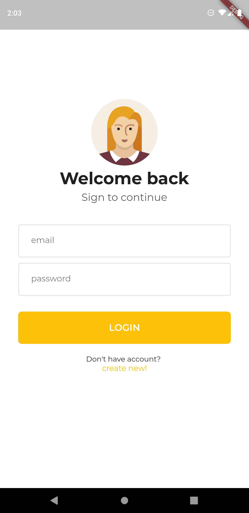
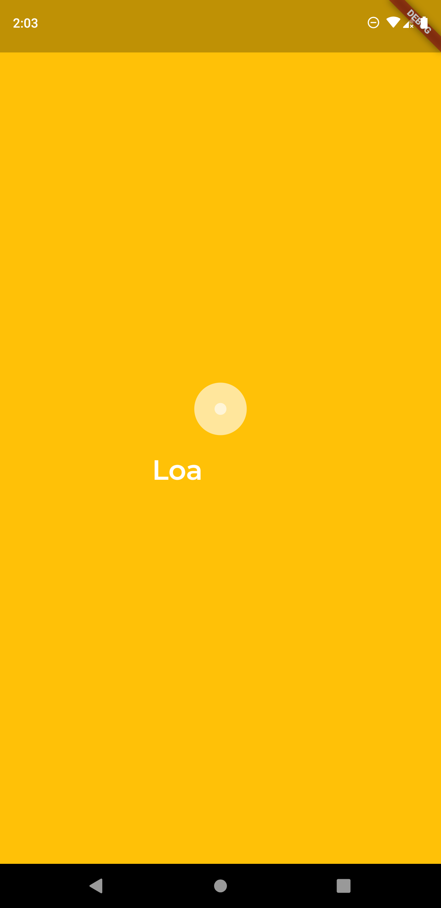
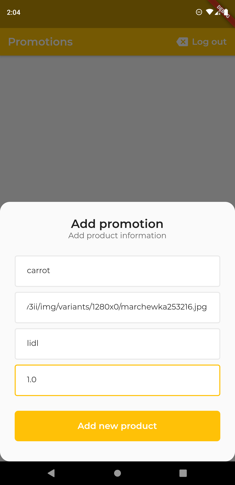
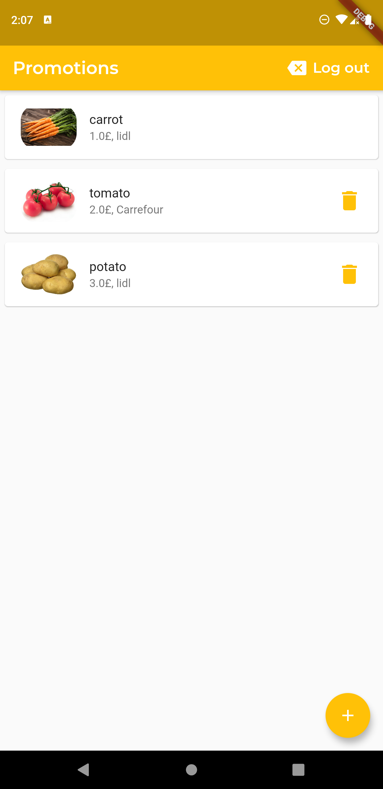

# Grocery Promotions App
# Grocery Promotions App in flutter

A new Flutter application.
#### Grocery Promotions App usign Google auth and firestore database

## Getting Started

#### Used features: 
- flutter material design library
- flutter spin kit library [link](https://pub.dev/packages/flutter_spinkit)
- flutter animated text kit library [link](https://pub.dev/packages/animated_text_kit)
- flutter provider library [link](https://pub.dev/packages/provider)
- flutter firebase_auth library [link](https://pub.dev/packages/firebase_auth)
- flutter firestore database library [link](https://pub.dev/packages/cloud_firestore)

A few resources to get you started if this is your first Flutter project:
- [Lab: Write your first Flutter app](https://flutter.dev/docs/get-started/codelab)
- [Cookbook: Useful Flutter samples](https://flutter.dev/docs/cookbook)

### App was created in flutter language which is based on dart.

#### Used technology
- async tasks
- build listview with builder method
- used maps and lists
- used navigator component
- custom classes and widgets
- login or register with google auth
- save your own movies in google firestore database
- usign bottom sheet for add promotions

## Screenshots :

## Thanks for reading. Don't forget to star my project 
